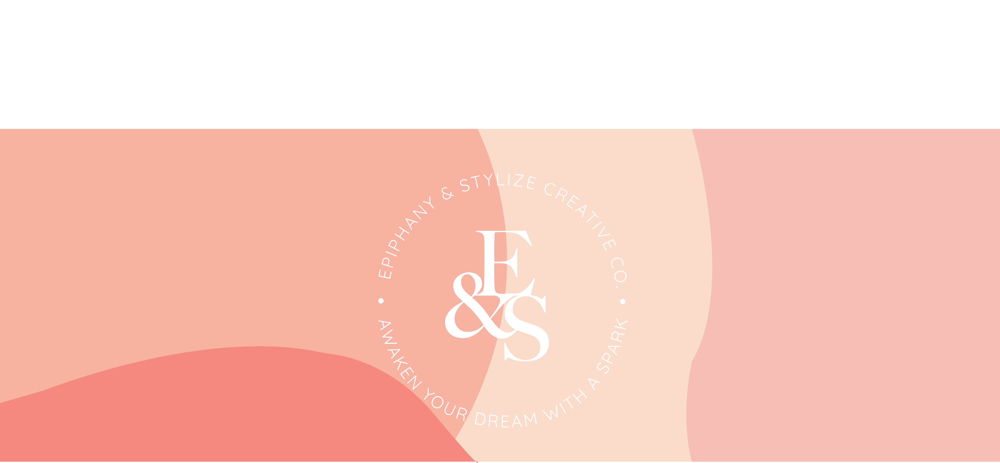

<h1>EPIPHANY</h1>
We are a start-up marketing studio that beleive in one main ingredient: to transalate customer visions into pixel-perfect websites or smooth-running applications. We are a team of talented individuals specializing in front-end development. 

Our mission is to envolop the meaning of epiphany into our works. Bring to our customer's vision to a new life. We beleive in tuning in on new mixtures of styles that push us forward. 
We dont want you to just glance and look at our work. In fact, we want you to feel the spark; take our novel clear path.
<h1>We want to bring that spark to life. For front rows to be amazed so DROP ON IN!.</h1>

<h2>Bootcamp Project</h2>

This is for the 2021 Bootcamp Project - Advertising StartUp AGency 

<h2>Meet the Team:</h2>
<ul>
<li>Ashwin Nandakumar <a href="https://github.com/ash674">@ash674</a></li>
<li>Jiaxu Liu</li>
<li>Kanak Kumar @Gene3829</li>
<li>Evica Mai <a href="https://github.com/evica-ai">@evica-ai</a></li>
</ul>

<h3>Prerequisites</h3>

All you need is a browser with a working Internet connection.

<h3>Usage<h3>

Check the main branch, clone/download the project (cd to your chosen directory)

<h3>Built with:</h3>
<ul>
<li><a href="https://www.w3.org/TR/2008/WD-html5-20080122/">HTML 5</a></li>
<li><a href="https://www.w3.org/Style/CSS/Overview.en.html">CSS</a></li>
<li><a href="https://developer.mozilla.org/en-US/docs/Web/CSS/CSS_Animations">CSS Animations</a></li>
<li><a href="https://www.w3schools.com/js/DEFAULT.asp">Javascript</a></li>
<li><a href="https://www.adobe.com/ca/creativecloud/buy/students.html">Adobe After Effects and Illustrator</a></li>
</ul>

<h2>License: MIT</h2>
